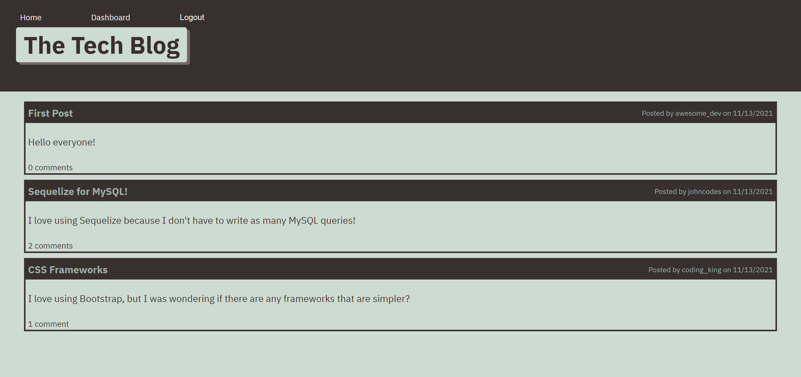

# Tech Blog


[](https://choosealicense.com/licenses/mit/)

## Description
A CMS-style blog site for developers to publish articles, blog posts, thoughts, and opinions for others to read and comment on.



## Table of Contents
* [Link](#link)
* [Installation](#installation)
* [Usage](#usage)
* [Passwords](#passwords)
* [Templating](#templating)
* [License](#license)
* [Questions](#questions)

## Link
[Click here](https://the-tech-blog-24601.herokuapp.com/) to go to the deployed application.

## Installation
To install the app on your machine for development and testing:

1. Install [Node.js](https://nodejs.org/en/) and [MySQL](https://dev.mysql.com/downloads/mysql) if you haven't already.
    - You can follow this [installation guide](https://coding-boot-camp.github.io/full-stack/mysql/mysql-installation-guide) to help you install MySQL.
2. Clone this repository onto your computer.
3. Navigate to the root of this repository on the command line.
4. Run `npm install` on the command line.
5. Run the following command to install the necessary packages:
```
npm install express express-handlebars mysql2 sequelize connect-session-sequelize bcrypt dotenv;
```
6. Run `mysql -u root -p` on the command line and enter your MySQL password to open the MySQL interface.
7. In MySQL, run `SOURCE ./db/schema.sql` to set up the `tech_blog_db` database.
8. In the root directory of the repository, run `touch .env` on the command line to create an environment variable file.
9. In the `.env` file, type the following:
```
DB_NAME='tech_blog_db'
DB_USER= [YOUR MYSQL USERNAME HERE]
DB_PW= [YOUR MYSQL PASSWORD HERE]
```
10. In `server.js`, set `sequelize.sync({ force: true })` as shown below to sync the database:
```javascript
sequelize.sync({ force: true }).then(() => {
    app.listen(PORT, () => console.log(`Listening on port ${PORT}`));
});
```
11. Remember to set it back to `{ force: false }` once you have set up the database.

## Usage
1. Go to the deployed app at [https://the-tech-blog-24601.herokuapp.com/](https://the-tech-blog-24601.herokuapp.com/).
2. Click on posts to view comments.
3. Click on "Login" to login or signup.
4. Click on "Dashboard" to view your post dashboard.
5. From your dashboard, click on a post to update it or delete it.
6. From the homepage while logged in, click on a post to view and add comments.
7. Click on "Logout" to logout.

## Passwords
This application hashes passwords to maintain security through bcrypt.

## Templating
This application uses [express-handlebars](https://www.npmjs.com/package/express-handlebars) for templating.

## License
Licensed under the [MIT](https://choosealicense.com/licenses/mit/) license.

## Questions
- [GitHub](https://github.com/kg-phantom)